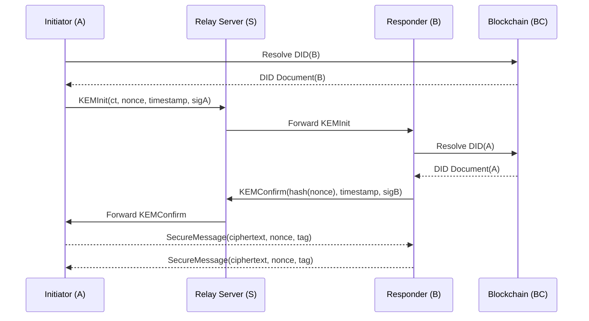

## Goal
- **身份认证**：通过 DID Document + 签名验证。
- **密钥机密性**：通过 Kyber768 封装，保证共享密钥不可恢复。
- **抗重放**：通过 nonce + timestamp + hash(nonce)。
- **抗 MITM**：通过双向签名绑定消息内容。
- **抗量子**：通过 Kyber768（KEM）和可选 Dilithium（签名）。
- **前向安全性**：可选，如果在 KDF 里引入会话随机性。
## 参与方

**A — Initiator（发起方）**
- 在区块链上注册 DID Document
- 查询 B 的 DID Document 并验证签名
- 生成随机种子 RS 与随机数 nonce
- 使用 B 的 Kyber 公钥封装 RS
- 构造并签名 KEMInit 消息
- 验证 B 的 KEMConfirm 消息
- 派生会话密钥

**B — Responder（响应方）**
- 查询 A 的 DID Document 并验证签名
- 验证 A 的 KEMInit 消息签名
- 使用 Kyber 私钥解封装 RS
- 计算 hash(nonce) 并签名
- 构造 KEMConfirm 消息
- 派生会话密钥

**S — Relay Server（中继服务器）**
- 仅负责消息转发
- 不可信（zero-trust）
- 不参与任何密码学操作
- 不需要保存状态

**BC — Blockchain（区块链）**
- 存储 DID Document
- 提供不可篡改性
- 提供 DID Document 的可验证性（签名 + 链上状态）

---
## Algorithm 
### 1. Signature Rules
#### **KEMInit（A → B）**
- **签名覆盖字段**：`type, from, to, ct, nonce, timestamp`
- **签名算法**：Ed25519 / Dilithium
- **签名公钥来源**：A 的 DID Document 中 `authentication` 指定的公钥
- **验证流程**：B 解析 A 的 DID Document → 提取公钥 → 验证签名 → 确认消息未被篡改且确实来自 A。

#### **KEMConfirm（B → A）**
- **签名覆盖字段**：`type, from, to, nonce_hash, timestamp`
- **签名算法**：Ed25519 / Dilithium
- **签名公钥来源**：B 的 DID Document 中 `authentication` 指定的公钥
- **验证流程**：A 解析 B 的 DID Document → 提取公钥 → 验证签名 → 确认 B 收到 nonce 并绑定会话。

#### **SecureMessage（A ↔ B）**
- **完整性保证**：AES‑GCM 自带 MAC（`tag` 字段），不需要额外签名。
- **验证流程**：接收方使用会话密钥解密并验证 GCM tag。

### 2. Cryptographic Suite
| 用途   | 算法                  | 备注                    |
| ---- | ------------------- | --------------------- |
| 身份签名 | Ed25519 / Dilithium | 用于 DID Document 和握手消息 |
| KEM  | Kyber768            | 用于共享密钥封装              |
| Hash | SHA‑256             | 用于 nonce 哈希、防重放       |
| 对称加密 | AES‑256‑GCM         | 用于会话消息加密              |
| KDF  | HKDF‑SHA256         | 从 RS 派生会话密钥           |

### 3. 协议流程Protocol Flow



---
## DataModel
### Message Categories
1. **KEMInit**（A → B，经由 S）
	- A 发起握手，包含 Kyber 封装的随机种子、nonce、防重放信息、签名。
2. **KEMConfirm**（B → A，经由 S）
    - B 响应握手，解封装种子，返回 hash(nonce) 的签名，确认身份与会话绑定。
3. **SecureMessage**（A ↔ B，经由 S）
    - 双方使用协商出的 AES 会话密钥加密的实际通信消息。

#### KEMInit 消息（A → B）
用途：A 发起握手，传递随机种子（封装后）、nonce、防重放信息。
```json
{
  "type": "KEMInit",
  "from": "did:qlink:A",
  "to": "did:qlink:B",
  "ct": "BASE64(Kyber768_Encapsulate(RS, pkB))",
  "nonce": "random_128bit",
  "timestamp": 1730000000,
  "signature": "Sign_A(ct || nonce || timestamp || from || to)"
}
```
- **KEMInit**：签名覆盖 `type, from, to, ct, nonce, timestamp`。
#### **KEMConfirm 消息（B → A）**
用途：B 解封装 RS，确认收到 nonce，并证明身份。
```json
{
    "type": "KEMConfirm",
    "from": "did:qlink:B",
    "to": "did:qlink:A",
    "nonce_hash": "SHA256(nonce)",
    "timestamp": 1730000001,
    "signature": "Sign_B(nonce_hash || timestamp || from || to)"
}
```
- **KEMConfirm**：签名覆盖 `type, from, to, nonce_hash, timestamp`。
#### **SecureMessage（A ↔ B）**
用途：双方使用协商出的 AES 会话密钥加密通信。
```json
{
  "type": "SecureMessage",
  "from": "did:qlink:A",
  "to": "did:qlink:B",
  "ciphertext": "BASE64(AES-GCM-Encrypt(session_key, plaintext))",
  "nonce": "random_96bit",
  "tag": "AES-GCM-MAC"
}
```
- **SecureMessage**：AES‑GCM 自带完整性校验，不需要额外签名。

#### DID Document
```json
{
  "id": "did:qlink:123456789abcdef",
  "version": 2,
  "revoked": false,
  "created": "2026-01-01T10:00:00Z",
  "updated": "2026-01-15T08:00:00Z",
  "verificationMethod": [
    {
      "id": "#sig-key-1",
      "type": "Ed25519VerificationKey2020",
      "publicKeyBase58": "3r2q9X...abc" 
    },
    {
      "id": "#kem-key-1",
      "type": "Kyber768PublicKey",
      "publicKeyBase64": "MIIBIjANBgkqhkiG9w0BAQEFAAOCAQ8A..."
    }
  ],
  "authentication": [
    "#sig-key-1"
  ],
  "proof": {
    "type": "Ed25519Signature2020",
    "created": "2026-01-15T08:00:00Z",
    "proofPurpose": "assertionMethod",
    "verificationMethod": "#sig-key-1",
    "signatureValue": "z8f9k...xyz"
  }
}
```


