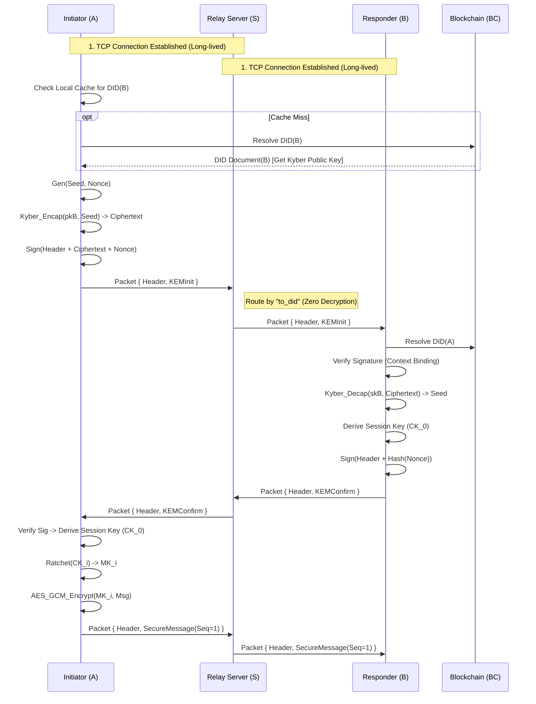

# QLink Protocol Specification

> **Version:** 1.0.0
> **Status:** Draft Standard
> **Transport:** TCP (Length-Prefixed Frames) + Protobuf
> **Security Model:** Post-Quantum, Zero-Trust Relay, DID-Anchored

---

## 1. Executive Summary (摘要)

QLink 是一种去中心化的、抗量子的认证密钥交换协议（AKE）。它旨在解决当前 DID 网络中的 **Security-Latency Paradox（安全-时延悖论）**，并为后量子时代（Post-Quantum Era）的移动通信提供轻量级的前向安全机制。

### 1.1 Design Goals (设计目标)

- **Identity Authentication (身份认证)**: 基于区块链上的 DID Document 和非对称签名 (Ed25519/Dilithium) 验证通信双方身份，杜绝中间人伪造。
- **Post-Quantum Confidentiality (抗量子机密性)**: 使用 **Kyber768 (ML-KEM)** 封装共享密钥，确保即使在“现在的流量被存储，未来的量子计算机解密”场景下，密钥依然安全。
- **Forward Secrecy (前向安全性)**: 通过 **Q-Ratchet** (Hash-based Key Evolution) 机制，确保单次密钥泄露不会危害历史通信记录。
- **Anti-Replay & Anti-MITM (抗重放与抗中间人)**: 采用 `Timestamp` + `Nonce` + `Context-Binding Signature` 三重防御体系。
- **Zero-Trust Architecture (零信任架构)**: 中继服务器（Relay）仅作为 TCP 路由节点，无法解密内容，无法篡改路由指令。

---

## 2. Theoretical Framework (理论框架)

本协议引入了两个核心理论贡献，解决了传统 DID 通信的效率与成本问题。

### 2.1 Contribution A: S-AKE (Speculative Authenticated Key Exchange)

**Problem:** 区块链查询的高延迟 ($T_{chain}$) 与即时通讯的低延迟需求 ($T_{net}$) 存在根本冲突。
**Mechanism:** QLink 引入 **Optimistic Verifiable Caching** 机制。
- 协议允许会话基于本地缓存的 DID Document 进入 `Speculative_State`（推测状态）。
- 后台异步校验链上状态，一旦发现 `parent_hash` 不一致，触发 **Mandatory Rollback**（强制回滚），立即销毁密钥并中断会话。
- **理论模型**: 将安全性定义为时间的函数 $P(\Delta t)$，在 $\Delta t$ 窗口内以极低的概率风险换取 $O(T_{chain})$ 的性能提升。

### 2.2 Contribution B: Q-Ratchet (Lightweight PQC Ratchet)

**Problem:** Signal 的双棘轮 (Double Ratchet) 依赖连续的 DH 交换。在后量子时代，Kyber 的密文尺寸（~1KB）导致连续 KEM 交换对带宽压力过大。

**Mechanism:** QLink 采用 **Hybrid Entropy-Injection**（混合熵注入）。

- **Packet-Level**: 使用轻量级哈希函数 (HKDF chain) 进行每消息的密钥滚动 (Per-message Ratcheting)。
- **Epoch-Level**: 周期性触发 KEM 握手，注入新的量子熵，实现自我修复 (Self-Healing)。
- **Optimization**: $Minimize \ Cost = N \cdot C_{hash} + C_{KEM}$。

---

## 3. System Architecture (系统架构)

### 3.1 Participants (参与方)

|**Role**|**Symbol**|**Description**|**Trust Level**|
|---|---|---|---|
|**Initiator**|**A**|发起握手的一方。负责生成随机种子 RS，使用 B 的 Kyber 公钥封装，并签名发送。|Trusted Endpoint|
|**Responder**|**B**|响应握手的一方。负责解封装 RS 得到共享密钥，验证 A 的身份，并返回 Nonce 确认。|Trusted Endpoint|
|**Relay Server**|**S**|**不可信节点**。仅负责维护 TCP 长连接，解析 `Packet.Header.to_did` 进行消息转发。无法解密 Payload。|**Zero Trust**|
|**Blockchain**|**BC**|**信任锚**。存储 DID Document，提供公钥的不可篡改性和可验证性。|Root of Trust|

### 3.2 Cryptographic Suite (密码套件)

|**Component**|**Algorithm**|**Purpose**|
|---|---|---|
|**Identity Signature**|**Ed25519** (or Dilithium3)|用于 DID Document 自证明及握手消息签名 (Authentication)|
|**KEM**|**Kyber768** (ML-KEM-768)|抗量子密钥封装，建立初始共享秘密 (Confidentiality)|
|**Hash**|**SHA-256**|用于计算 Nonce Hash 及签名摘要|
|**Symmetric Enc**|**AES-256-GCM**|用于握手后的应用层消息加密 (AEAD)|
|**KDF**|**HKDF-SHA256**|用于从 Kyber 种子派生会话密钥，以及 Q-Ratchet 密钥演化|

---

## 4. Protocol Logic & Algorithm (核心算法)

### 4.1 Signature Rules (上下文绑定规则)

为了防止中继服务器篡改路由信息（例如将 A 发给 B 的包转给 C），QLink 强制执行 **Context-Binding Signature**。

- **Rule 1: KEMInit Signature (A → B)**

  - **Signer**: Initiator ($sk_A$)
  - **Payload**: `Serialize(Header) || Kyber_Ciphertext || Nonce`
  - **Logic**: 签名必须覆盖 Header 中的 `from_did`, `to_did`, `timestamp`。接收方 B 必须先验证 Header 未被篡改，再进行解封装。

- **Rule 2: KEMConfirm Signature (B → A)**

  - **Signer**: Responder ($sk_B$)
  - **Payload**: `Serialize(Header) || SHA256(Nonce)`
  - **Logic**: B 对收到的 Nonce 进行哈希并签名，证明其拥有私钥并已收到 A 的请求。

### 4.2 Q-Ratchet Logic (密钥演化)

为了实现前向安全，会话密钥 $MK$ 和 链密钥 $CK$ 必须随每一条消息单向演化。

$$CK_{i+1} = \text{HKDF}(CK_i, \text{"next"})$$

$$MK_{i} = \text{HKDF}(CK_i, \text{"msg"})$$

- 发送方在加密第 $i$ 条消息后，必须立即覆盖删除 $CK_i$ 和 $MK_i$。
- `Sequence Number` 用于同步双方的链状态。

---

## 5. Protocol Flow (协议流程)



---

## 6. Data Model (数据模型)

协议采用 **Envelope Pattern (信封模式)**。所有数据包在 TCP 拆包（Length-Prefixed）后，统一映射为 `Packet` 结构。

### 6.1 The Envelope (Packet Structure)

_对应 Protobuf 定义 `message Packet`_

```JSON
{
  "header": {
    "request_id": "123e4567-e89b-12d3-a456-426614174000", // UUID for tracing
    "from_did": "did:qlink:initiator_addr",
    "to_did": "did:qlink:responder_addr",               // Routing Target
    "timestamp": 1737456000000                          // Anti-replay window
  },
  // Mutually Exclusive Payload (oneof)
  "payload": {
    "kem_init": { ... },       // OR
    "kem_confirm": { ... },    // OR
    "secure_message": { ... }
  }
}
```

### 6.2 Specific Payloads

#### **Type 1: KEMInit (Handshake Request)**

```JSON
"kem_init": {
  "ct": "<base64_1088_bytes_kyber_ciphertext>",
  "nonce": "<base64_32_bytes_random>", // Used for key derivation & anti-replay
  "signature": "<base64_signature_of_header_and_payload>"
}
```

#### **Type 2: KEMConfirm (Handshake Response)**

```JSON
"kem_confirm": {
  "nonce_hash": "<base64_sha256_of_received_nonce>", // Proof of receipt
  "signature": "<base64_signature_of_header_and_payload>"
}
```

#### **Type 3: SecureMessage (Encrypted Data)**

```JSON
"secure_message": {
  "sequence_number": 1, // Strictly increasing for Ratchet synchronization
  "ciphertext": "<base64_aes_gcm_ciphertext>",
  "nonce": "<base64_12_bytes_gcm_nonce>",
  "tag": "<base64_16_bytes_gcm_tag>"
}
```

### 6.3 DID Document Standard

_存储在区块链上的身份文档，扩展支持 Kyber768。_

```JSON
{
  "id": "did:qlink:123456789abcdef",
  "version": 2,
  "revoked": false,
  "created": "2026-01-01T10:00:00Z",
  "updated": "2026-01-15T08:00:00Z",
  "verificationMethod": [
    {
      "id": "#sig-key-1",
      "type": "Ed25519VerificationKey2020",
      "publicKeyBase58": "3r2q9X...abc"
    },
    {
      "id": "#kem-key-1",
      "type": "Kyber768PublicKey",
      "publicKeyBase64": "MIIBIjANBgkqhkiG9w0BAQEFAAOCAQ8A..."
    }
  ],
  "authentication": [
    "#sig-key-1"
  ],
  "proof": {
    "type": "Ed25519Signature2020",
    "created": "2026-01-15T08:00:00Z",
    "proofPurpose": "assertionMethod",
    "verificationMethod": "#sig-key-1",
    "signatureValue": "z8f9k...xyz"
  }
}
```

# 7. Open Issues & Future Work (未解决问题与未来工作)

### 7.1 Rollback Synchronization (回滚同步机制)

- **Issue:** 当前定义的 _Mandatory Rollback_ 缺乏明确的同步流程。若一方检测到 DID Document 不一致并销毁密钥，另一方可能仍保持会话状态，导致状态不一致。
- **Future Work:** 引入专门的 `Rollback` 控制消息（例如 `Packet.Status` with `ERROR_VERIFICATION_FAILED`），确保双方在回滚时同步终止会话。

### 7.2 Nonce Semantics (Nonce 语义区分)

- **Issue:** 握手阶段的 Nonce 同时用于防重放与密钥派生，语义存在混淆。
- **Future Work:** 将 Nonce 拆分为 `nonce_replay`（防重放）与 `nonce_kdf`（密钥派生），在数据模型中明确区分，提高协议可读性与安全性。

### 7.3 DID Document PQC Extension (DID 文档的后量子扩展)

- **Issue:** 当前 DID Document 示例仅展示了 Ed25519 签名。若要支持 Dilithium3 等 PQC 签名，需要在 `verificationMethod` 和 `proof` 中扩展类型。
- **Future Work:** 定义新的 `VerificationMethod` 类型，例如 `Dilithium3VerificationKey2025`，并在 `proof` 中支持 PQC 签名格式。

### 7.4 Relay Traffic Analysis Resistance (中继流量分析防护)

- **Issue:** 虽然 Relay 无法解密内容，但仍可能通过流量模式分析推断通信关系。
- **Future Work:** 在协议中引入 **Cover Traffic**（伪流量）或 **Padding**（消息填充），降低流量分析风险。

### 7.5 Ratchet Epoch Trigger Policy (棘轮周期触发策略)

- **Issue:** Q-Ratchet 的 Epoch-Level KEM 注入未定义具体触发条件。不同实现可能导致安全性不一致。
- **Future Work:** 明确策略，例如：
  - 每发送 N 条消息触发一次 KEM 注入；
  - 或每 T 秒触发一次；
  - 或结合带宽与安全需求的自适应策略。
