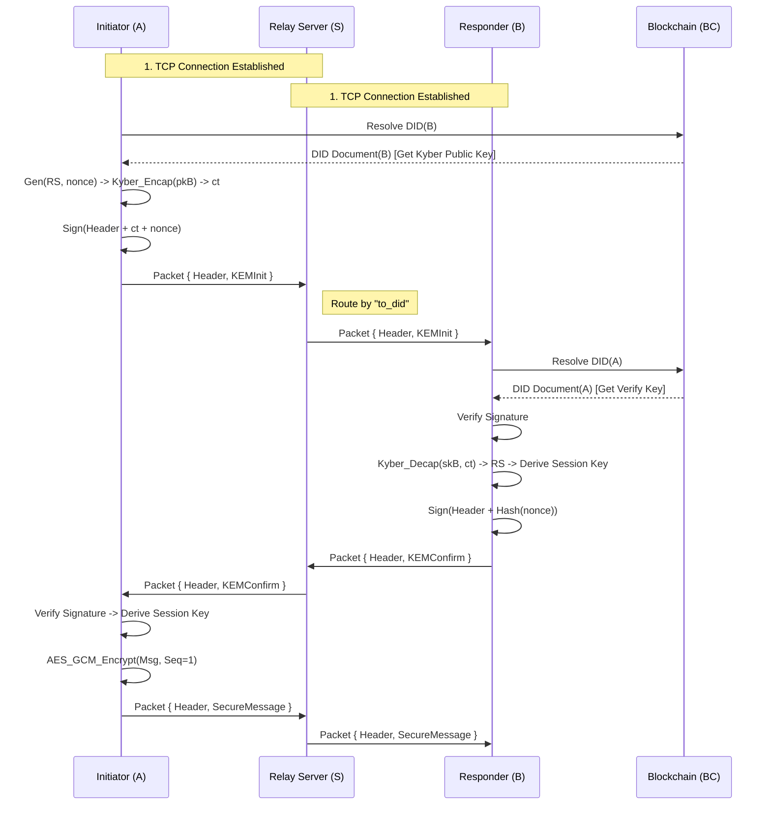

# DID-Anchored Post-Quantum Authenticated Key Exchange Protocol

> Protocol Version: 1.0.0
> 
> Transport: TCP (Length-Prefixed Frames) + Protobuf

## 1. Goal (设计目标)

- **Identity Authentication (身份认证)**: 基于 DID Document 和非对称签名 (Ed25519/Dilithium) 验证通信双方身份。
- **Confidentiality (机密性)**: 使用 **Kyber768 (ML-KEM)** 封装共享密钥，保证即使在量子计算环境下，密钥也无法被解密。
- **Anti-Replay (抗重放)**: 通过 `timestamp` (时间窗口) + `nonce` (唯一随机数) + `sequence_number` (序列号) 三重机制防止重放攻击。
- **Anti-MITM (抗中间人)**: 签名强制绑定路由上下文 (`Header`), 防止中继服务器篡改源或目的地址。
- **Zero-Trust Relay (零信任中继)**: 中继服务器仅负责根据 Header 路由 TCP 包，无法解密内容，也无法伪造签名。
    

## 2. Participants (参与方)

|**Role**|**Description**|
|---|---|
|**Initiator (A)**|发起握手的一方。负责生成随机种子 RS，使用 B 的 Kyber 公钥封装，并签名发送。|
|**Responder (B)**|响应握手的一方。负责解封装 RS 得到共享密钥，验证 A 的身份，并返回 Nonce 确认。|
|**Relay Server (S)**|**不可信节点**。仅负责维护 TCP 长连接，解析 `Packet.Header.to_did` 进行消息转发。|
|**Blockchain (BC)**|**信任锚**。存储 DID Document，提供公钥的不可篡改性和可验证性。|

## 3. Algorithm & Logic (核心算法)

### 3.1 Cryptographic Suite

|**Component**|**Algorithm**|**Purpose**|
|---|---|---|
|**Identity Signature**|**Ed25519** (or Dilithium3)|用于 DID Document 验证及握手消息签名|
|**KEM**|**Kyber768** (ML-KEM-768)|抗量子密钥封装，建立共享密钥种子|
|**Hash**|**SHA-256**|用于计算 Nonce Hash 及签名摘要|
|**Symmetric Enc**|**AES-256-GCM**|用于握手后的会话消息加密 (AEAD)|
|**KDF**|**HKDF-SHA256**|从 Kyber 解出的种子派生 AES 会话密钥|

### 3.2 Signature Rules (关键安全逻辑)

为了防止中继服务器篡改路由信息（例如将 A 发给 B 的包转给 C），**签名必须覆盖 Header 上下文**。

#### **Rule 1: KEMInit Signature (A → B)**

- **Signing Key**: A's Private Key (Ed25519)
- **Data to Sign**: `Serialize(Header) || ct || nonce`
    - _Header 包含: request_id, from_did, to_did, timestamp_
- **Verification**: B 收到包后，重组 Header 和 Payload 字节，使用 A 的公钥验签。

#### **Rule 2: KEMConfirm Signature (B → A)**

- **Signing Key**: B's Private Key (Ed25519)
- **Data to Sign**: `Serialize(Header) || nonce_hash`
- **Verification**: A 收到包后，重组数据，使用 B 的公钥验签。

---

## 4. Protocol Flow (协议流程)



---

## 5. Data Model (数据模型)

协议采用 **信封模式 (Envelope Pattern)**。所有网络包在 TCP 层解包后，都映射为统一的 `Packet` 结构。

### 5.1 The Envelope (Packet)

```JSON
{
  "header": {
    "request_id": "123e4567-e89b-12d3-a456-426614174000",
    "from_did": "did:qlink:initiator_addr",
    "to_did": "did:qlink:responder_addr",
    "timestamp": 1737456000000
  },
  // Payload (oneof) - 下面只能出现其中一个字段
  "kem_init": { ... },
  "kem_confirm": { ... },
  "secure_message": { ... }
}
```

### 5.2 Payloads

#### **Type 1: KEMInit (Handshake Request)**

```JSON
"kem_init": {
  "ct": "<base64_1088_bytes_kyber_ciphertext>",
  "nonce": "<base64_32_bytes_random>",
  "signature": "<base64_signature_of_header_and_payload>"
}
```

#### **Type 2: KEMConfirm (Handshake Response)**

```JSON
"kem_confirm": {
  "nonce_hash": "<base64_sha256_of_received_nonce>",
  "signature": "<base64_signature_of_header_and_payload>"
}
```

#### **Type 3: SecureMessage (Encrypted Data)**

```JSON
"secure_message": {
  "sequence_number": 1,
  "ciphertext": "<base64_aes_gcm_ciphertext>",
  "nonce": "<base64_12_bytes_gcm_nonce>",
  "tag": "<base64_16_bytes_gcm_tag>"
}
```

#### **Type 4: Infrastructure (DID Resolution)**

```JSON
"did_request": {
  "target_did": "did:qlink:target_addr"
}
```

```JSON
"did_response": {
  "document": "<bytes_of_json_ld_did_document>",
  "error": "" 
}
```

#### **Type 5: Status (Generic Response)**

```JSON
"status": {
  "reply_to_id": "123e4567-e89b-12d3-a456-426614174000",
  "code": "ERROR_VERIFICATION_FAILED",
  "message": "Signature mismatch on KEMInit"
}
```

### 5.3 DID Document Example

存储在区块链上的身份文档标准结构 (JSON-LD)。

```JSON
{
  "id": "did:qlink:123456789abcdef",
  "version": 2,
  "revoked": false,
  "created": "2026-01-01T10:00:00Z",
  "updated": "2026-01-15T08:00:00Z",
  "verificationMethod": [
    {
      "id": "#sig-key-1",
      "type": "Ed25519VerificationKey2020",
      "publicKeyBase58": "3r2q9X...abc"
    },
    {
      "id": "#kem-key-1",
      "type": "Kyber768PublicKey",
      "publicKeyBase64": "MIIBIjANBgkqhkiG9w0BAQEFAAOCAQ8A..."
    }
  ],
  "authentication": [
    "#sig-key-1"
  ],
  "proof": {
    "type": "Ed25519Signature2020",
    "created": "2026-01-15T08:00:00Z",
    "proofPurpose": "assertionMethod",
    "verificationMethod": "#sig-key-1",
    "signatureValue": "z8f9k...xyz"
  }
}
```